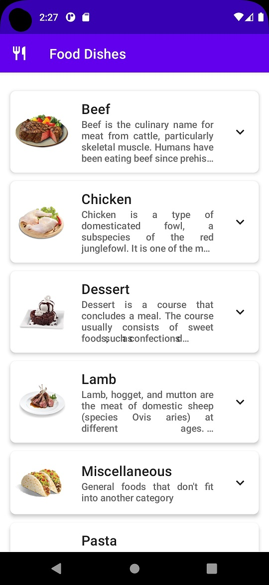
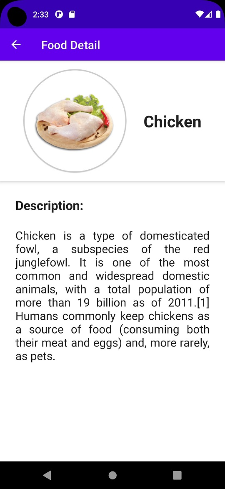

# AS-Compose-MVVM-FoodDishesMenu
Application that shows a list of meals using the API service of the TheMealDB website.

## Architecture Used
MVVM Architecture

## Libraries
- Retrofit + Gson
- Landscapist
- ViewModel for Compose
- Navigation with Compose

## Output
 ### Main page

 ### Food Details page

